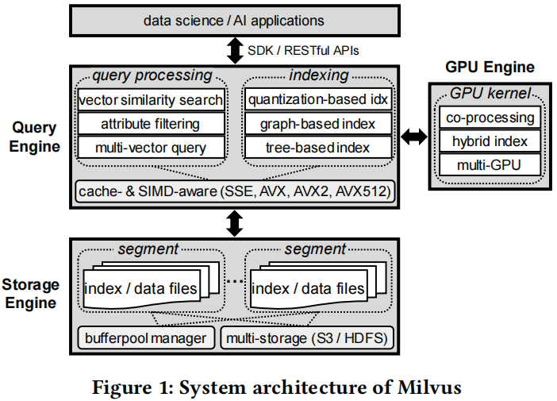
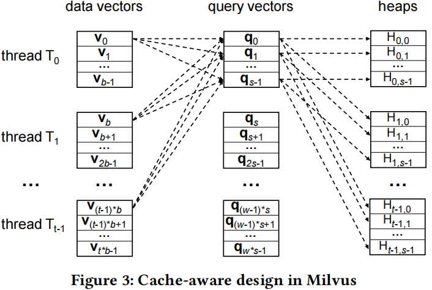
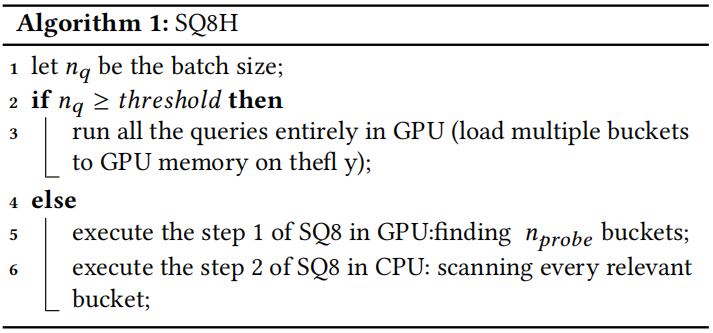
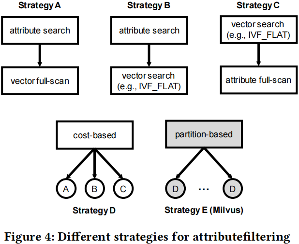
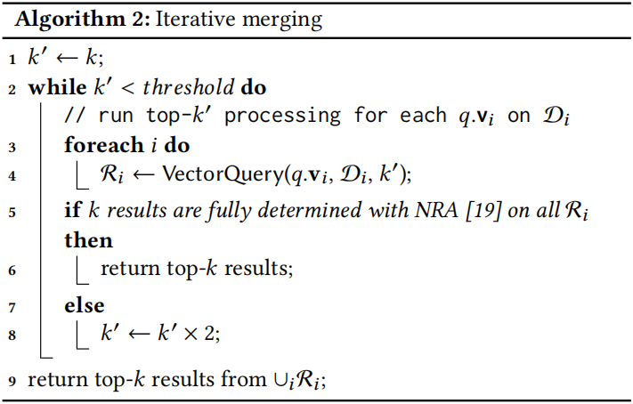

# Milvus

## System Design

### Entity

Each entity in Milvus is described as one or more **vectors** and optionally some numerical **attributes** (non-vector data).

### Query Types

- Vector query
- Attribute filtering
- Multi-vector query

###  Indexing

- **Quantization-based indexes**: IVF_FLAT, IVF_SQ8, and IVF_PQ
- **Graph-based indexes**: HNSW, NSG

### Dynamic Data Management

Milvus supports efficient **insertions** and **deletions** by adopting the idea of **LSM-tree**.

##  Heterogeneous Computing

### **CPU-oriented Optimizations**

- Cache-aware optimizations

- SIMD-aware optimizations
  - Supporting AVX512
  - Automatic SIMD-instruction selection

### GPU-oriented Optimizations

- Supporting bigger $k$ in GPU kernel: $1024\rightarrow 16384$
- Supporting multi-GPU devices

### GPU and CPU Co-design

Since GPU memory is not enough large to store entire data, data needs to be moved from CPU memory to GPU memory through PCIe bus. 

There are two limitations:

- The PCIe bandwidth is not fully utilized (1~2GB/s < 15.75GB/s)
- It is not always beneficial to execute queries on GPU

Milvus develops an new index called SQ8H to address these above limitations.

## Query Processing

### Attribute Filtering

An entity is associated with a single vector and a single attribute. Additionally, a query involves two conditions $\mathcal{C}_A$  and $\mathcal{C}_V$ where  $\mathcal{C}_A$ specifies the attribute constraint and $\mathcal{C}_V$ denotes the normal query vector. $\mathcal{C}_A$ is represented in the form of $a\geq p_1 \land a\leq p_2$​. 

- **Strategy A: attribute-first-vector-full-scan.** It is suitable when **$\mathcal{C}_A$​ is highly selective** such that only a small  number of candidates need further verification.
- **Strategy B: attribute-first-vector-search.** This strategy is suitable in many cases when $\mathcal{C}_A$ or $\mathcal{C}_V$ is **moderately selective**.
- **Strategy C: vector-first-attribute-full-scan.** This strategy is suitable when the vector constraint **$\mathcal{C}_V$​ is highly selective** that the number of candidates is relatively small.
- **Strategy D: cost-based.** This strategy is suitable in almost all cases.

- **Strategy E: partition-based (Milvus).** The main idea is that it partitions the dataset based on the **frequently searched attribute** and applies the cost-based approach (i.e., the strategy D) for each partition (similar to [BinDex](https://dl.acm.org/doi/10.1145/3318464.3380563)).

###  Multi-vector Queries

Each entity contains $\mu$ vectors $\mathrm{v}_0, \mathrm{v}_1, \cdots, \mathrm{v}_{\mu-1}$, and the multi-vector query find the top-$k$ entities according to the aggregated scoring function $g$ over the similarity function $f$ of each individual vector $\text{v}_i$.

- **Naive solution.** This solution issues an individual top-$k$ query for each vector to produce a set of candidates which are further computed to obtain the final top-$k$ results. It leads to **extremely low recall**.
- **Vector fusion.** This approach applies the aggregation function $g$ to the $\mu$ vectors of query, producing an aggregated query vector. It requires a **decomposable similarity function** such as inner product.
- **Iterative merging.** 

## System Implementation

### Asynchronous Processing

### Snapshot Isolation

### Distributed System
